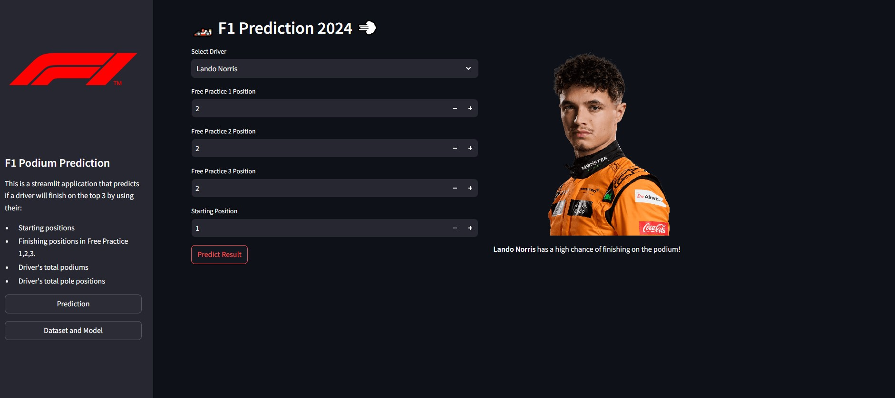

# F1 Podium Predictor (2024)
This is a streamlit application that predicts if a driver will finish on the top 3 by using their: 
- Free Practice 1 Position
- Free Practice 2 Position
- Free Practice 3 Position
- Starting Position
- Driver's Total Podium Count
- Driver's Total Pole Position Count

The model used for this application is **Decision Tree Classifier** which has an accuracy of **91%**
